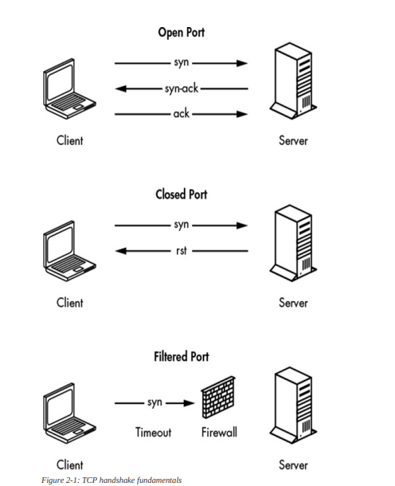

# Chapter 2 Notes (TCP,Scanners and Proxies)

[Port Forwarding](https://learn.g2.com/port-forwarding)

[Golang net.Dial](https://pkg.go.dev/net#Dial)

Dial Examples:
* Dial("tcp", "golang.org:http")
* Dial("tcp", "192.0.2.1:http")
* Dial("tcp", "198.51.100.1:80")
* Dial("udp", "[2001:db8::1]:domain")
* Dial("udp", "[fe80::1%lo0]:53")
* Dial("tcp", ":80")

### [Bufio Package Golang](https://medium.com/golangspec/introduction-to-bufio-package-in-golang-ad7d1877f762)
