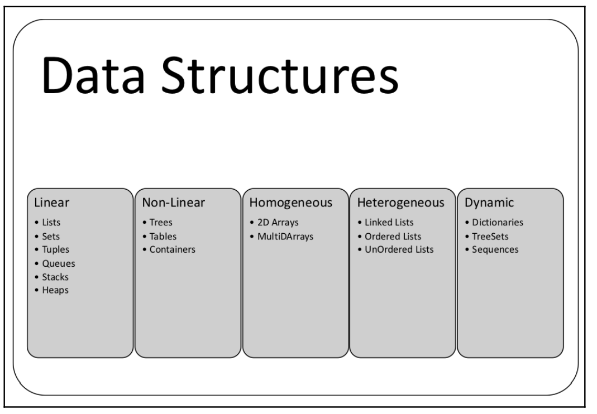

# Chapter 1 Notes

# Chapter 01 Source Code List

* [Adapter](./adapter.go)
* [Backtracking](./backtracking.go)
* [Bridge](./bridge.go)
* [Bruteforce](./bruteforce.go)
* [Complexity](./complexity.go)
* [Composite](./composite.go)
* [Decorator](./decorator.go)
* [Divide](divede.go)
* [Facade](./facade.go)
* [Flyweight](./flyweight.go)
* [Heap](./heap.go)
* [Linear complexity](./linear_complexity.go)
* [List](./list.go)
* [Num Operations](./num_operations.go))
* [Private Class](./privateclass.go)
* [Quadratic Complexity](./quadratic_complexity.go) 

* 

# List

* [List](./list.go)
* [Golang container/list](https://pkg.go.dev/container/list)==>[source code](https://cs.opensource.google/go/go/+/refs/tags/go1.18.4:src/container/list/list.go)

# Tuples

* [Tuples](./tuples.go)
* [Tuples Example](https://codesource.io/how-to-use-tuple-in-golang/)
  
# Heaps

* The heap data structure is used in selection, graph, and k-way merge algorithms. Operations such as finding,
merging, insertion, key changes, and deleting are performed on heaps. Heaps are part of
the container/heap package in Go. 
* [Heaps](./heap.go)
* [Heaps container/heap](https://pkg.go.dev/container/heap)
* [Heaps Source Code](https://github.com/cs.opensource.google/go/go/+/refs/tags/go1.18.4:src/container/heap/heap.go;drc=2580d0e08d5e9f979b943758d3c49877fb2324cb;l=32)


# Desing Patterns

## Adapter Pattern

* [Adapter Pattern Refactoring Guru](https://refactoring.guru/design-patterns/adapter)
* [Adapter Pattern Source Code Example](https://refactoring.guru/design-patterns/adapter/go/example)
* [Book Source Code](./adapter.go)

## Bridge Pattern

* [Bridge Pattern](https://refactoring.guru/design-patterns/bridge)
* [Bridge Pattern Source Code Example](https://refactoring.guru/design-patterns/bridge/go/example)
* [Book Source Code](./bridge.go)

## Composite Pattern

* [Composite Pattern](https://refactoring.guru/design-patterns/composite)
* [Composite Pattern Source Code Example](https://refactoring.guru/design-patterns/composite/go/example)
* [Book Source Code](./composite.go)

## Decarator Pattern

* [Decarator Pattern](https://refactoring.guru/design-patterns/decorator)
* [Decarator Pattern Source Code Example](https://refactoring.guru/design-patterns/decorator/go/example)
* [Book Source Code](./decorator.go)

## Decorator Pattern

* [Decorator Pattern](https://refactoring.guru/design-patterns/decorator)
* [Decorator Pattern Source Code Example](https://refactoring.guru/design-patterns/decorator/go/example)
* [Book Source Code](./decorator.go)


## Facade Pattern

* [Facade Pattern](https://refactoring.guru/design-patterns/facade)
* [Facade Pattern Source Code Example](https://refactoring.guru/design-patterns/facade/go/example)
* [Book Source Code](./facade.go)

## Flyweight Pattern

* [Flyweight Pattern](https://refactoring.guru/design-patterns/)
* [Flyweight Pattern Source Code Example](https://refactoring.guru/design-patterns/flyweight/go/example)
* [Book Source Code](./flyweight.go)

## Private Class Data

```
Account is a class with account details and a customer name. AccountDetails is the
private attribute of Account , and CustomerName is the public attribute. JSON marshaling
of Account has CustomerName as a public property. AccountDetails is the package
property in Go (modeled as private class data):
``` 
[See in source code](./privatDataeclass.go)
[Take a look at the](https://stackoverflow.com/a/69098785/6946237)

## Proxy Pattern

* [Proxy Pattern](https://refactoring.guru/design-patterns/proxy)
* [Proxy Pattern Source Code Example](https://refactoring.guru/design-patterns/proxy/go/example)
* [Book Source Code](./proxy.go)

