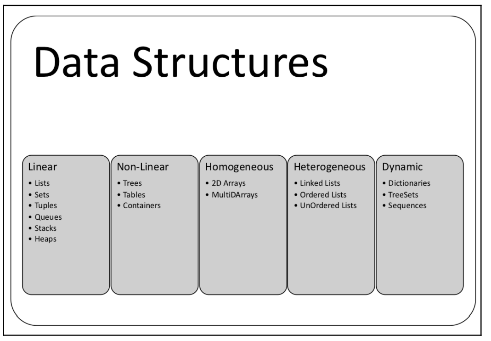

# Chapter 1 Notes

* 

# List

* [List](./list.go)
* [Golang container/list](https://pkg.go.dev/container/list)==>[source code](https://cs.opensource.google/go/go/+/refs/tags/go1.18.4:src/container/list/list.go)

# Tuples

* [Tuples](./tuples.go)
* [Tuples Example](https://codesource.io/how-to-use-tuple-in-golang/)
  
# Heaps

* The heap data structure is used in selection, graph, and k-way merge algorithms. Operations such as finding,
merging, insertion, key changes, and deleting are performed on heaps. Heaps are part of
the container/heap package in Go. 
* [Heaps](./heap.go)
* [Heaps container/heap](https://pkg.go.dev/container/heap)
* [Heaps Source Code](https://github.com/cs.opensource.google/go/go/+/refs/tags/go1.18.4:src/container/heap/heap.go;drc=2580d0e08d5e9f979b943758d3c49877fb2324cb;l=32)