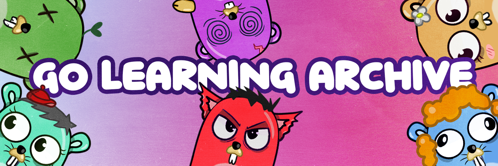

# Go Learning Archive

>**Although there are many good videos and tutorials, Good Gopher never underestimates the knowledge contained in books.**
# Game Plan

Our main plan is to collect **high-quality learning materials** in the same place in a well-structured manner. All goodies for golang are welcome for PRs. Also, we will give you free NFTs for staring this repo. You can go and check for [GLL website](https://golearningland.com/). If you hate NFTs that is fine; we will give NFTs as a symbol of a community badge do not worry and do not hate us.

### How to mint GLL NFTs?

1. Wait for minting state. Follow us on [Twitter](https://twitter.com/GoLearningLand)
2. Go to [GLL website](https://golearningland.com) and click on mint button shown in image.
3. Use your Metamask wallet for pay gas fees. See more information on [Metamask website](https://metamask.io/)
4. Wait for yout NFT to appear in wallet.

# Folder Structures and Indexes

* [Training](#training-plan) => This folder contains all materials ordered ways for learning golang.(In Progress)
* [Data Structures and Algorithms](./GolangDataStructuresAndAlgorithms/) => This folder contains the algorithms and data structures implemented in Go
* [Basics](./GolangBasics/) => This folder contains basics tutorial for Golang
* [Advanced](./GolangAdvanced/) =>This folder contains Advanced tutorial for Golang
* [Clean Code](./GolangCleanCode/) => This folder contains Clean Code tips and tricks for Golang
* [Concurrency](./GolangConcurrency/) => This folder contains Concurrency tutorial for Golang
* [Testing](./GolangTesting/) => This folder contains Testing tutorial for Golang
* [Code Layout](./GolangCodeLayout/) => This folder contains best practice for code layout
* [Distributed System](./GolangDistributed/) => This folder contains Distributed tutorial for Golang
* [Books](./GolangBooks/) => This folder contains Books summary and source code for Golang
* [Security](./GolangSecurity/) => This folder contains Security tutorial materials for Golang

# Training Plan

### Base boilplate is taken from [here](https://github.com/GoTurkiye/training)

* Basics
	* Variables
	* Array
    * Slices
    * Maps
    * Strings
    * Loops
    * Structs
    * Pointers
    * Functions
    * Errors
    * Interfaces
    * Modules

* Concurrency
  * Basics
  * In Depth
	* Go Routines
	* Channels
    * WaitGroups
    * Mutex
    * SyncPool
    * Dead Lock

* Garbage Collector
	* Basics
	* In Depth

* Http Package
	* http
	* httputil
    * grpc
    * Reverse Proxy
    * Restful Api
    * Web Frameworks (echo, gin, fasthttp)

* I/O
	* File ops.
	* Network ops.
    * Bytes
    * io.Reader
    * io.Writer
    * io.TeeReader
    * io.MultiWriter

* CLI
	* Flags
	* Environments
    * Bytes
    * Variables
    * Parameters
    * Commands

* GUI
  * [Wails](https://wails.app/)
  * GUI Examples  

* Test & Benchmarks
	* Unit Test
	* Benchmark Test
    * Tracing
    * Profiling

* Algorithms
	* Sorting
	* LinkedList
    * Stack
    * Queue
    * Tree
    * Graphs
    * Dynamic Programming
    * Many More will be added in a future release

* Database
	* Sql Queries
	* Transactions
    * CRUD Operations
    * Couchbase Ops
  * Examples with different DBs

* External Communication
	* Redis
	* Rabbitmq
    * Kafka

* Build & Distribution
	* Docker Build
	* Go Releaser
    * Github Actions

* Architecture - Overview
	* Abstraction / Decoupling
	* Inversion Of Control
    * Dependency Injection
    * Composition Root
    * Hexagonal Architecture
    * DDD
    * CQRS
    * Event Sourcing
    * Clean Code

* Kubernetes Extensibility
	* Accessing Kubernetes
	* Admission Webhook Concept
    * Operators

### Doesn't seem enough? Then create issues and start helping!!
# Selected Golang Book List

  
Click Here for Book List

  
# Books

**[Credits](https://github.com/dariubs/GoBooks)**
### [Go Bootcamp](http://www.golangbootcamp.com/) *Free*

This companion book contains material initially written specifically for this event as well as content from Google & the Go team under Creative Commons Attribution 3.0 License and code licensed under a BSD license.
[Source code of Book](https://github.com/GoBootcamp/book)
### Chapters of Book
* [Chapter1 Intro](https://www.golangbootcamp.com/book/intro)
* [Chapter2 The Basics](https://www.golangbootcamp.com/book/basics)
* [Chapter3 Types](https://www.golangbootcamp.com/book/types)
* [Chapter4 Coleections Types](https://www.golangbootcamp.com/book/collection_types)
* [Chapter5 Control Flow](https://www.golangbootcamp.com/book/control_flow)
* [Chapter6 Methods](https://www.golangbootcamp.com/book/methods)
* [Chapter7 Interfaces](https://www.golangbootcamp.com/book/interfaces)
* [Chapter8 Concurrency](https://www.golangbootcamp.com/book/concurrency)
* [Chapter9 Get Setup](https://www.golangbootcamp.com/book/get_setup)
* [Chapter10](https://www.golangbootcamp.com/book/get_your_feet_wet)
* [Chapter11 Tips and tricks](https://www.golangbootcamp.com/book/tricks_and_tips)

### [Learning Go](http://www.miek.nl/go) *Free*

A online book to start learning Golang. It features numerous exercises (and answers).

### [Learn Go With Tests](https://quii.gitbook.io/learn-go-with-tests/) *Free*

Learn Go guided by tests. Write a test, learn a new Go language feature to make it pass, refactor and repeat. You'll get a grounding in test-driven development and importantly understand the principles behind it.
* [Chapter 1 Install Go](https://quii.gitbook.io/learn-go-with-tests/go-fundamentals/install-go)
* [Chapter 2 Hello](https://quii.gitbook.io/learn-go-with-tests/go-fundamentals/hello-world)
* [Chapter 3 Integers](https://quii.gitbook.io/learn-go-with-tests/go-fundamentals/integers)
* [Chapter 4 Iteration](https://quii.gitbook.io/learn-go-with-tests/go-fundamentals/iteration)
* [Chapter 5 Array and Slice](https://quii.gitbook.io/learn-go-with-tests/go-fundamentals/arrays-and-slices)
* [Chapter 6 Structs Method and Interface](https://quii.gitbook.io/learn-go-with-tests/go-fundamentals/structs-methods-and-interfaces)
* [Chapter 7 Pointer and Error](https://quii.gitbook.io/learn-go-with-tests/go-fundamentals/pointers-and-errors)
* [Chapter 8 Maps](https://quii.gitbook.io/learn-go-with-tests/go-fundamentals/maps)
* [Chapter 9 Dependency Injection](https://quii.gitbook.io/learn-go-with-tests/go-fundamentals/dependency-injection)
* [Chapter 10 Mocking](https://quii.gitbook.io/learn-go-with-tests/go-fundamentals/mocking)
* [Chapter 11 Concurrency](https://quii.gitbook.io/learn-go-with-tests/go-fundamentals/concurrency)
* [Chapter 12 Select](https://quii.gitbook.io/learn-go-with-tests/go-fundamentals/select)
* [What is Reflection ?](https://golangbot.com/reflection/)
* [Chapter 13 Reflection](https://quii.gitbook.io/learn-go-with-tests/go-fundamentals/reflection)
* [Chapter 14 Sync](https://quii.gitbook.io/learn-go-with-tests/go-fundamentals/sync#copying-mutexes)
* [Chapter 15 Context](https://quii.gitbook.io/learn-go-with-tests/go-fundamentals/context)

### [Go 101](https://go101.org/article/101.html) *Free*

Go 101 is a book focusing on Go syntax/semantics and all kinds of runtime related things (Go 1.17-pre ready) and tries to help gophers gain a deep and thorough understanding of Go. This book also collects many details of Go and in Go programming. It is expected that this book is helpful for both beginner and experienced Go programmers.
### Notes About Go 101
* [go vet](https://siderlabs.com/blog/lets-use-go-vet-the-standard-tool-for-analyzing-go-s-source-code-59435ea71059/)

### [Practical Go Lessons](https://www.practical-go-lessons.com/) *Free*

Practical Go Lessons has 41 chapters and more than 700 pages with illustrations.
It is suitable for anybody how wants to start programming with the Go language.
It assumes no prior knowledge. 
Each chapter contains test questions with detailed answers.
The HTML version is free. You can support the author by buying the PDF or Paper version.

### [Go in Action](https://www.manning.com/books/go-in-action)

Go in Action introduces the Go language, guiding you from inquisitive developer to Go guru. The book begins by introducing the unique features and concepts of Go. (We assume you're up to speed with another programming language already, so don't expect to spend a lot of time rehearsing stuff you already know.) Then, you'll get hands-on experience writing real-world applications including web sites and network servers, as well as techniques to manipulate and convert data at speeds that will make your friends jealous. In the final chapters, you'll go in-depth with the language and see the tricks and secrets that the Go masters are using to make their applications perform. For example, you'll learn to use Go's powerful reflection libraries and work with real-world examples of integration with C code.

### [Go Programming Blueprints - 2nd Ed.](https://www.packtpub.com/application-development/go-programming-blueprints-second-edition)

This book shows you how to build powerful systems and drops you into real-world situations. Scale, performance, and high availability lie at the heart of our projects, and the lessons learned throughout this book will arm you with everything you need to build world-class solutions.

### [Programming in Go: Creating Applications for the 21st Century](http://www.informit.com/store/programming-in-go-creating-applications-for-the-21st-9780321774637)

 Programming in Go brings together all the knowledge you need to evaluate Go, think in Go, and write high-performance software with Go. Summerfield presents multiple idiom comparisons showing exactly how Go improves upon older languages, calling special attention to Go’s key innovations. Along the way, he explains everything from the absolute basics through Go’s lock-free channel-based concurrency and its flexible and unusual duck-typing type-safe approach to object-orientation.

### [The Go Programming Language](http://gopl.io/)

*The Go Programming Language* is the authoritative resource for any
programmer who wants to learn Go.
Alan A. A. Donovan and Brian W. Kernighan show you how to write clear
and idiomatic Go to solve real-world problems.
The book does not assume prior knowledge of Go nor experience with
any specific language, so you'll find it accessible whether you're
most comfortable with JavaScript, Ruby, Python, Java, or C++.

The book features hundreds of interesting and practical examples of
idiomatic Go code that cover the whole language, its most important libraries,
and a wide range of applications.
Source code is freely available for download from the book's companion web site
[gopl.io](http://gopl.io/),
and may be conveniently fetched, built, and installed using the `go get` command.

### [Introducing Go: Build Reliable, Scalable Programs](https://www.oreilly.com/library/view/introducing-go/9781491941997/)

Perfect for beginners familiar with programming basics, this hands-on guide provides an easy introduction to Go, the general-purpose programming language from Google. Author Caleb Doxsey covers the language's core features with step-by-step instructions and exercises in each chapter to help you practice what you learn.

### [Go Recipes](https://link.springer.com/book/10.1007/978-1-4842-1188-5)

Solve your Go problems using a problem-solution approach. Each recipe is a self-contained answer to a practical programming problem in Go. Go Recipes contains recipes that deal with the fundamentals of Go, allowing you to build simple, reliable, and efficient software. Other topics include working with data using modern NoSQL databases such as MongoDB and RethinkDB. The book provides in-depth guidance for building highly scalable backend APIs in Go for your mobile client applications and web client applications.

### [API Foundations in Go](https://leanpub.com/api-foundations)

With this book you'll learn to use Go, taking advantage of it's multi-threaded nature, and typed syntax. Starting your API implementation in Go is your first step towards what a rock solid API should be.

### [Building Distributed Applications in Gin](https://www.packtpub.com/product/building-distributed-applications-in-gin/9781801074858)

Gin is a high-performance HTTP web framework used to build web applications and microservices in Go. This book is designed to teach you the ins and outs of the Gin framework with the help of practical examples.

You’ll start by exploring the basics of the Gin framework, before progressing to build a real-world RESTful API. Along the way, you’ll learn how to write custom middleware and understand the routing mechanism, as well as how to bind user data and validate incoming HTTP requests. The book also demonstrates how to store and retrieve data at scale with a NoSQL database such as MongoDB, and how to implement a caching layer with Redis. Next, you’ll understand how to secure and test your API endpoints with authentication protocols such as OAuth 2 and JWT. Later chapters will guide you through rendering HTML templates on the server-side and building a frontend application with the React web framework to consume API responses. Finally, you’ll deploy your application on Amazon Web Services (AWS) and learn how to automate the deployment process with a continuous integration and continuous delivery (CI/CD) pipeline.

By the end of this Gin book, you will be able to design, build, and deploy a production-ready distributed application from scratch using the Gin framework.

### [Test-driven development with Go ](https://leanpub.com/golang-tdd) *Free*

A short guide to Test-driven development in golang. free to [read online](https://leanpub.com/golang-tdd/read).

### [Go programming language secure coding practices guide](https://checkmarx.gitbooks.io/go-scp/) *Free*

The main goal of this book is to help developers avoid common mistakes while at the same time, learning a new programming language through a "hands-on approach". This book provides a good level of detail on "how to do it securely" showing what kind of security problems could arise during development.

### [Go with the Domain: Building Modern Business Software in Go](https://threedots.tech/go-with-the-domain/) *Free*

*Go with the Domain* is a book on building Go applications that solve complex problems in an idiomatic way.
It features techniques like Domain-Driven Design, Clean Architecture, CQRS (Command Query Responsibility Segregation), and other patterns.

The book is based on a [real open source project](https://github.com/ThreeDotsLabs/wild-workouts-go-ddd-example).
Chapters go through refactoring of the project to show common anti-patterns and how to avoid them.

### [Network Programming with Go](https://nostarch.com/networkprogrammingwithgo)

Network Programming with Go will help you leverage Go to write secure, readable, production-ready network code. Network Programming with Go is all you'll need to take advantage of Go's built-in concurrency, rapid compiling, and rich standard library.

### [Mastering Concurrency in Go](https://www.amazon.com/Mastering-Concurrency-Go-Nathan-Kozyra/dp/1783983485)

This book will take you through the history of concurrency, how Go utilizes it, how Go differs from other languages, and the features and structures of Go's concurrency core. Each step of the way, the book will present real, usable examples with detailed descriptions of the methodologies used. By the end, you will feel comfortable designing a safe, data-consistent, high-performance concurrent application in Go.

### [Go in Practice](http://www.manning.com/butcher/)

Go in Practice guides you through dozens of real-world techniques in key areas like package management, microservice communication, and more. Following a cookbook-style Problem/Solution/Discussion format, this practical handbook builds on the foundational concepts of the Go language and introduces specific strategies you can use in your day-to-day applications. You'll learn techniques for building web services, using Go in the cloud, testing and debugging, routing, network applications, and much more.

### [Go Design Patterns](https://www.packtpub.com/application-development/go-design-patterns)
 

Learn idiomatic, efficient, clean, and extensible Go design and concurrency patterns by using TDD.

### [Black Hat Go](https://www.nostarch.com/blackhatgo)

In Black Hat Go, you'll learn how to write powerful and effective penetration testing tools in Go, a language revered for its speed and scalability. Start off with an introduction to Go fundamentals like data types, control structures, and error handling; then, dive into the deep end of Go’s offensive capabilities.

### [Concurrency in Go](http://shop.oreilly.com/product/0636920046189.do)

Concurrency can be notoriously difficult to get right, but fortunately, the Go open source programming language makes working with concurrency tractable and even easy. If you’re a developer familiar with Go, this practical book demonstrates best practices and patterns to help you incorporate concurrency into your systems.

### [Hands-On Dependency Injection in Go](https://amzn.to/2Q6dLQC)

Hands-On Dependency Injection in Go takes you on a journey, teaching you about refactoring existing code to adopt dependency injection (DI) using various methods available in Go.

Of the six methods introduced in this book, some are conventional, such as constructor or method injection, and some unconventional, such as just-in-time or config injection. Each method is explained in detail, focusing on their strengths and weaknesses, and is followed with a step-by-step example of how to apply it. With plenty of examples, you will learn how to leverage DI to transform code into something simple and flexible.

Hands-On Dependency Injection in Go takes a pragmatic approach and focuses heavily on the code, user experience, and how to achieve long-term benefits through incremental changes.

### [Hands-On Software Engineering with Golang](https://www.packtpub.com/gb/programming/hands-on-software-engineering-with-golang)

This Golang book distills industry best practices for writing lean Go code that is easy to test and maintain, and helps you to explore its practical implementation by creating a multi-tier application called Links ‘R’ Us from scratch. You’ll be guided through all the steps involved in designing, implementing, testing, deploying, and scaling an application. Starting with a monolithic architecture, you’ll iteratively transform the project into a service-oriented architecture (SOA) that supports the efficient out-of-core processing of large link graphs. 

You’ll learn about various cutting-edge and advanced software engineering techniques such as building extensible data processing pipelines, designing APIs using gRPC, and running distributed graph processing algorithms at scale.  Finally, you’ll learn how to compile and package your Go services using Docker and automate their deployment to a Kubernetes cluster.

### [Spaceship Go](https://blasrodri.github.io/spaceship-go-gh-pages/) **Free**

Spaceship Go is a journey to Go's Standard Library. Several key packages are explored in order to understand
why they are useful, and also how they are implemented under the hood. It serves as a reference of some key
available tools and primitives offered by the language, which can be very helpful to write performant and idiomatic
code.

### [Security with Go](https://www.packtpub.com/product/security-with-go/9781788627917)

Security with Go is the first Golang security book, and it is useful for both blue team and red team applications. With this book, you will learn how to write secure software, monitor your systems, secure your data, attack systems, and extract information.

Defensive topics include cryptography, forensics, packet capturing, and building secure web applications.

Offensive topics include brute force, port scanning, packet injection, web scraping, social engineering, and post exploitation techniques.

### [Writing An Interpreter In Go](https://interpreterbook.com/)

In this book we will create a programming language together.

We'll start with 0 lines of code and end up with a fully working interpreter for the Monkey* programming language.

Step by step. From tokens to output. All code shown and included. Fully tested.

### [Writing A Compiler In Go](https://compilerbook.com/)

This is the sequel to Writing An Interpreter In Go.

We're picking up right where we left off and write a compiler and a virtual machine for Monkey.

Runnable and tested code front and center, built from the ground up, step by step — just like before.

But this time, we're going to define bytecode, compile Monkey and execute it in our very own virtual machine.

It's the next step in Monkey's evolution.

### [Ultimate Go Notebook](https://courses.ardanlabs.com/courses/ultimate-go-notebook)

The Ultimate Go Notebook is the official companion book for the Ardan Labs Ultimate Go class. 

With this book, you will learn how to write more idiomatic and performant code with a focus on micro-level engineering decisions. 

This notebook has been designed to provide a reference to everything mentioned in class, as if they were your own personal notes.

### [100 Go Mistakes and How to Avoid Them](https://www.manning.com/books/100-go-mistakes-and-how-to-avoid-them)

100 Go Mistakes and How to Avoid Them puts a spotlight on common errors in Go code you might not even know you’re making. You’ll explore key areas of the language such as concurrency, testing, data structures, and more—and learn how to avoid and fix mistakes in your own projects.

### [Effective Go](https://www.manning.com/books/effective-go)

Effective Go is a practical guide to writing high-quality code that’s easy to test and maintain. The book is full of best practices to adopt and anti-patterns to dodge. It explores what makes Go so dramatically different from other languages, and how you can still leverage your existing skills into writing excellent Go code. Aimed at Go beginners looking to graduate to serious Go development, you’ll write and test command line applications, web API clients and servers, concurrent programs, and more.

### [Cloud Native Go - Building Reliable Services in Unreliable Environments](https://www.oreilly.com/library/view/cloud-native-go/9781492076322/)

What do Docker, Kubernetes, and Prometheus have in common? All of these cloud native technologies are written in the Go programming language.
This practical book shows you how to use Go's strengths to develop cloud native services that are scalable and resilient, even in an unpredictable environment.
You'll explore the composition and construction of these applications, from lower-level features of Go to mid-level design patterns to high-level architectural considerations.

### [Build an Orchestrator in Go](https://www.manning.com/books/build-an-orchestrator-in-go)

Understand Kubernetes and other orchestration systems deeply by building your own using Go and the Docker API. 

Orchestration systems like Kubernetes coordinate other software subsystems and services to create a complete organized system. Although orchestration tools have a reputation for complexity, they’re designed around few important patterns that apply across many aspects of software development. Build an Orchestrator in Go reveals the inner workings of orchestration frameworks by guiding you as you design and implement your own using the Go SDK. As you create your own orchestration framework, you’ll improve your understanding of Kubernetes and its role in distributed system design. You’ll also build the skills required to design custom orchestration solutions for those times when an out-of-the-box solution isn’t a good fit. 

**Web Development**
----
### [Building Web Apps with Go](https://www.gitbook.com/book/codegangsta/building-web-apps-with-go/details) *Free*

A good resource for start Building Web Apps with Go. Free to [read online](http://codegangsta.gitbooks.io/building-web-apps-with-go/content/).

### [Build Web Application with Golang](https://www.gitbook.com/book/astaxie/build-web-application-with-golang/details) *Free*

Another awesome book for learning Web Development in Golang. Free to [read online](http://astaxie.gitbooks.io/build-web-application-with-golang/content/en/index.html)

### [Webapps in Go the anti textbook](https://github.com/thewhitetulip/web-dev-golang-anti-textbook) *Free*

This book was written to teach how to develop web applications in Go for people who know a bit of Go and have basic information about web applications in general. We (you) will build a webapp without using a third party framework and using as few external libraries as possible. The advantage is that you'll learn a lot when you code without a framework.

### [Go Web Programming](http://www.manning.com/chang/)

Go Web Programming teaches you how to build web applications in Go using modern design principles. You'll work through numerous examples that introduce core concepts like processing requests and sending responses, template engines, and data persistence. You'll also dive into more advanced topics, such as concurrency, web application testing and deployment both to barebones servers and PaaS providers.

### [Cloud Native Go: Building Web Applications and Microservices for the Cloud with Go and React](https://www.informit.com/store/cloud-native-go-building-web-applications-and-microservices-9780672337796)

Today, companies and developers need to respond to changing markets at breakneck speeds. Organizations that aren't built on highly-available, rapidly-evolving software are going the way of the dinosaurs. Cloud Native Go brings together the knowledge developers need to build massive-scale cloud applications that meet the insatiable demands of today's customers and markets.

### [Web Development with Go: Learn to Create Real World Web Applications using Go](https://www.usegolang.com/)

Web Development with Go was written to teach both beginners and experts how to create and deploy a real web application. You won't be building a boilerplate TODO list, but will instead be creating and deploying a production ready photo gallery application, similar to Pixieset, from scratch. The book assumes no previous web development experience and covers everything you need to know to successfully build your own web application.

### [Go: Building Web Applications](https://amzn.com/B01LD8K5C0)

This course is an invaluable resource to help you understand Go's powerful features to build simple, reliable, secure, and efficient web applications.

### [Building Microservices with Go](https://www.packtpub.com/application-development/building-microservices-go)

Whether you are planning a new application or working in an existing monolith, this book will explain and illustrate with practical examples how teams of all sizes can start solving problems with microservices. It will help you understand Docker and Docker-Compose and how it can be used to isolate microservice dependencies and build environments. We finish off by showing you various techniques to monitor, test, and secure your microservices.

### [12 Factor Applications with Docker and Go](https://leanpub.com/12fa-docker-golang)

A book filled with examples on how to use Docker and Go to create the ultimate 12 Factor applications. It goes over individual steps of [The Twelve-Factor App](12factor.net) guidelines and how to implement them with Go and Docker.

### [Mastering Go, 3rd edition](https://www.packtpub.com/product/mastering-go-third-edition/9781801079310)

This is the 3rd edition of Mastering Go. There exist many exciting new topics in this latest edition including writing RESTful services, working with the Websocket protocol, using GitHub Actions and GitLab Actions for Go projects as well as an entirely new chapter on Generics and the development of lots of practical utilities.

### [Learn Data Structures and Algorithms with Golang](https://www.packtpub.com/product/learn-data-structures-and-algorithms-with-golang/9781789618501)

The book begins with an introduction to Go data structures and algorithms. You'll learn how to store data using linked lists, arrays, stacks, and queues. Moving ahead, you'll discover how to implement sorting and searching algorithms, followed by binary search trees. This book will also help you improve the performance of your applications by stringing data types and implementing hash structures in algorithm design. Finally, you'll be able to apply traditional data structures to solve real-world problems.
By the end of the book, you'll have become adept at implementing classic data structures and algorithms in Go, propelling you to become a confident Go programmer.

